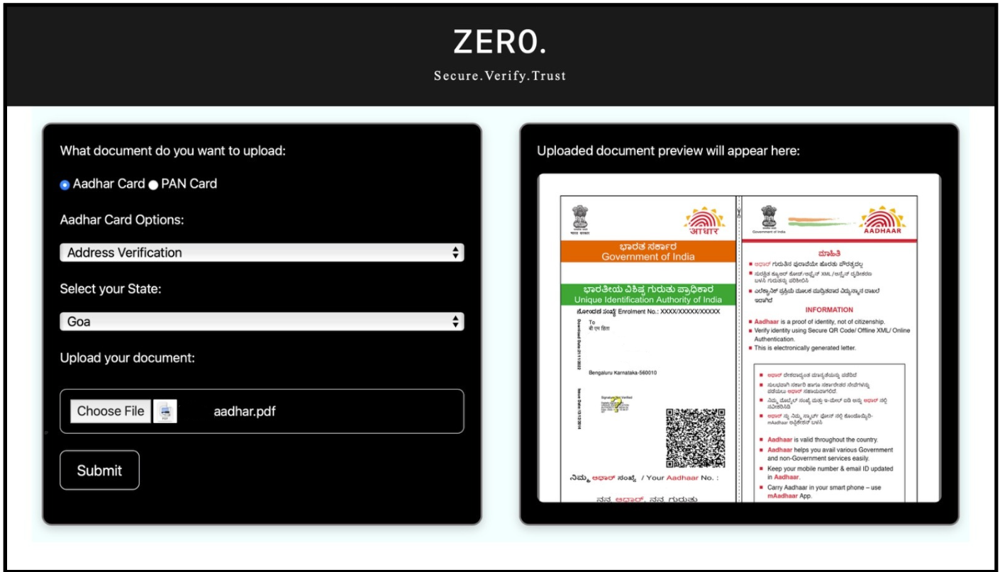

# 💻 Hacktivists 6 – Cybersecurity Awareness & Phishing Simulation Platform

An interactive web-based platform built to **educate users about cybersecurity** threats through **simulated phishing attacks** and awareness modules. Designed as a part of a social initiative to build safer internet habits and reduce susceptibility to common digital threats.

---

## 🎯 Objective

To enhance cybersecurity awareness by:

* Simulating real-world phishing attacks in a controlled environment.
* Analyzing user behavior and response to such attacks.
* Educating users on how to identify and avoid digital threats like phishing, malware, and social engineering.

---

## 🔧 Features

* 🎣 **Phishing Email Simulation**
  Send mock phishing emails to users and track their interactions.

* 📊 **Analytics Dashboard**
  View detailed reports of user behavior (e.g., clicked links, submitted data, ignored emails).

* 📚 **Awareness Modules**
  Provide informative content and tutorials about phishing, spoofing, password safety, etc.

* 🔒 **Login & Admin Control**
  Secure authentication and admin interface to manage campaigns and users.

* 🧪 **Test Campaigns**
  Launch test simulations with customized phishing templates.

---

## 🛠️ Tech Stack

* **Frontend**: HTML, CSS, JavaScript
* **Backend**: Node.js, Express.js
* **Database**: MongoDB (with Mongoose ODM)
* **Authentication**: bcrypt, express-session

---

## 🚀 Getting Started

### 1. Clone the Repository

```bash
git clone https://github.com/Aldrin-Rodrigues/hacktivists_6.git
cd hacktivists_6
```

### 2. Install Dependencies

```bash
npm install
```

### 3. Setup `.env` File

Create a `.env` file in the root directory with the following:

```env
MONGODB_URI=mongodb://localhost:27017/hacktivists_db
SESSION_SECRET=your_secret_key
```

### 4. Start the Server

```bash
npm start
```

Visit [http://localhost:3000](http://localhost:3000) to use the platform.

---


## 📸 Screenshots



---

## 👥 Contributors

* Aldrin Rodrigues
* Ankit Arjunagi
* Hitha
* Erin

---

## 📄 License

This project is licensed under the **MIT License** – see the [LICENSE](LICENSE) file for details.
